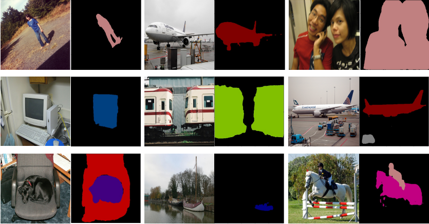

# Project Overview:

### TODO
- [x] Support different backbones for image segmintation
- [x] Implement basic Image classification CNN
- [ ] Implement training methods for the CNN
- [ ] Add an interface for manual dataset input
- [ ] Train the DeepCVS on the given dataset
- [ ] Improve DeeplabV3+ results over the given dataset
- [ ] Try different backbones - mobilenet,resnet,xception

### Reference:
    The project is based on the following paper: https://icube-publis.unistra.fr/docs/14676/hal.pdf

### Goal: 
    We wish to help surgeons properly identify parts of the body by checking if 3 criteria’s were met
### Data: 
    The input we have is videos from different surgeries that took place between 2015-2019.
### Data sets: 
    1-CVS Dataset: from each 1 minute long video we extract 60 frames – 1 fps. 
    For each picture we use 3 criteria classification to identify an organ structure namely: c1 c2 c3 
    2-Segmentation dataset: Two images at least 10 seconds apart and 1 image meeting 3/3 criteria

### DeepCVS: 
    a 2-stage model to segment hepatocystic anatomy and predict whether each of the 3 CVS criteria has 
    been achieved in a laparoscopic image.
    
### First stage: 
    The first stage of DeepCVS is a segmentation network that is used to classify pixels of the image 
    according to the anatomical structures they belong to.
    After the first stage, the pixel classified image along with the original image are fed into stage2
    
### Second stage: 
    a multi-label classification network, which outputs 3 non-exclusive probability-like values
 


# pytorch-deeplab-xception

**Update on 2018/12/06. Provide model trained on VOC and SBD datasets.**  

**Update on 2018/11/24. Release newest version code, which fix some previous issues and also add support for new backbones and multi-gpu training. For previous code, please see in `previous` branch**  


| Backbone  | train/eval os  |mIoU in val |Pretrained Model|
| :-------- | :------------: |:---------: |:--------------:|
| ResNet    | 16/16          | 78.43%     | [google drive](https://drive.google.com/open?id=1NwcwlWqA-0HqAPk3dSNNPipGMF0iS0Zu) |
| MobileNet | 16/16          | 70.81%     | [google drive](https://drive.google.com/open?id=1G9mWafUAj09P4KvGSRVzIsV_U5OqFLdt) |
| DRN       | 16/16          | 78.87%     | [google drive](https://drive.google.com/open?id=131gZN_dKEXO79NknIQazPJ-4UmRrZAfI) |


### Introduction
This is a PyTorch(0.4.1) implementation of [DeepLab-V3-Plus](https://arxiv.org/pdf/1802.02611). It
can use Modified Aligned Xception and ResNet as backbone. Currently, we train DeepLab V3 Plus
using Pascal VOC 2012, SBD and Cityscapes datasets.




### Installation
The code was tested with Anaconda and Python 3.6. After installing the Anaconda environment:

0. Clone the repo:
    ```Shell
    git clone https://github.com/jfzhang95/pytorch-deeplab-xception.git
    cd pytorch-deeplab-xception
    ```

1. Install dependencies:

    For PyTorch dependency, see [pytorch.org](https://pytorch.org/) for more details.

    For custom dependencies:
    ```Shell
    pip install matplotlib pillow tensorboardX tqdm
    ```
### Training
Follow steps below to train your model:

0. Configure your dataset path in [mypath.py](https://github.com/jfzhang95/pytorch-deeplab-xception/blob/master/mypath.py).

1. Input arguments: (see full input arguments via python train.py --help):
    ```Shell
    usage: train.py [-h] [--backbone {resnet,xception,drn,mobilenet}]
                [--out-stride OUT_STRIDE] [--dataset {pascal,coco,cityscapes}]
                [--use-sbd] [--workers N] [--base-size BASE_SIZE]
                [--crop-size CROP_SIZE] [--sync-bn SYNC_BN]
                [--freeze-bn FREEZE_BN] [--loss-type {ce,focal}] [--epochs N]
                [--start_epoch N] [--batch-size N] [--test-batch-size N]
                [--use-balanced-weights] [--lr LR]
                [--lr-scheduler {poly,step,cos}] [--momentum M]
                [--weight-decay M] [--nesterov] [--no-cuda]
                [--gpu-ids GPU_IDS] [--seed S] [--resume RESUME]
                [--checkname CHECKNAME] [--ft] [--eval-interval EVAL_INTERVAL]
                [--no-val]

    ```

2. To train deeplabv3+ using Pascal VOC dataset and ResNet as backbone:
    ```Shell
    bash train_voc.sh
    ```
3. To train deeplabv3+ using COCO dataset and ResNet as backbone:
    ```Shell
    bash train_coco.sh
    ```    

### Acknowledgement
[PyTorch-Encoding](https://github.com/zhanghang1989/PyTorch-Encoding)

[Synchronized-BatchNorm-PyTorch](https://github.com/vacancy/Synchronized-BatchNorm-PyTorch)

[drn](https://github.com/fyu/drn)
